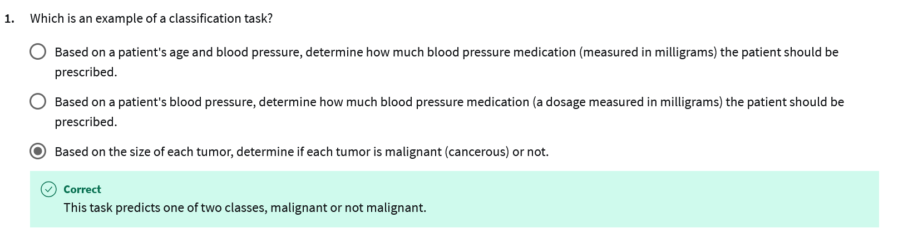
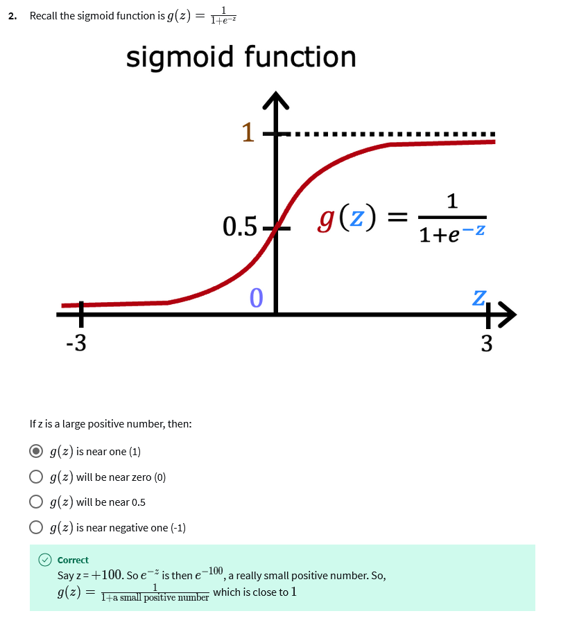
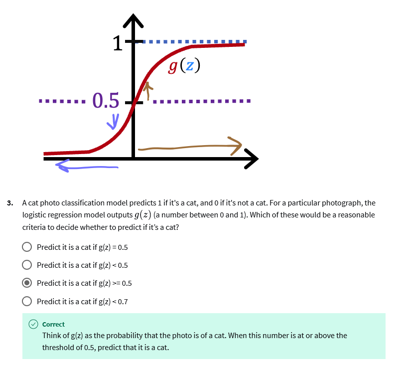
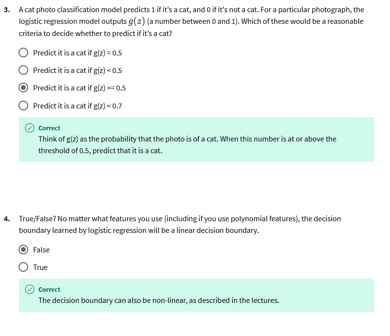
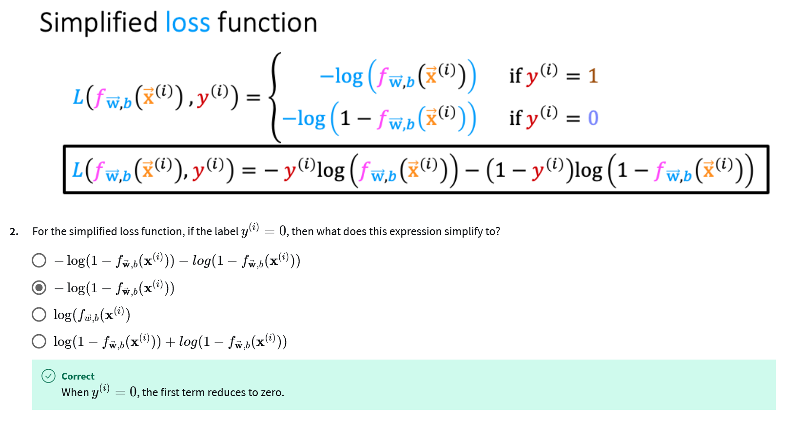
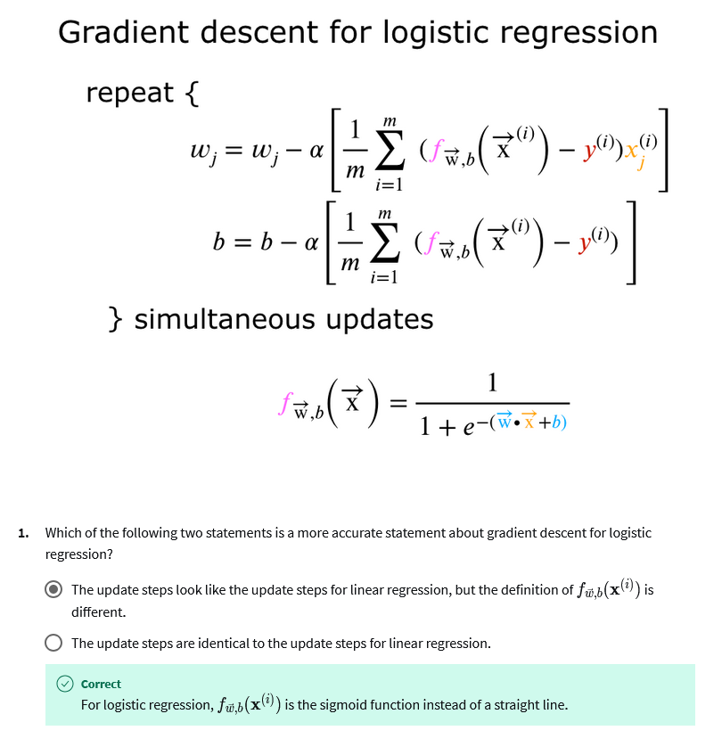

# Practice Quizzes (Graded/Non-Graded)

Below are the pratice quizzes for the week 3.

## Classification with logistic regression

## Cost function for logistic regression

## Gradient descent for logistic regression

## The problem of over-fitting

